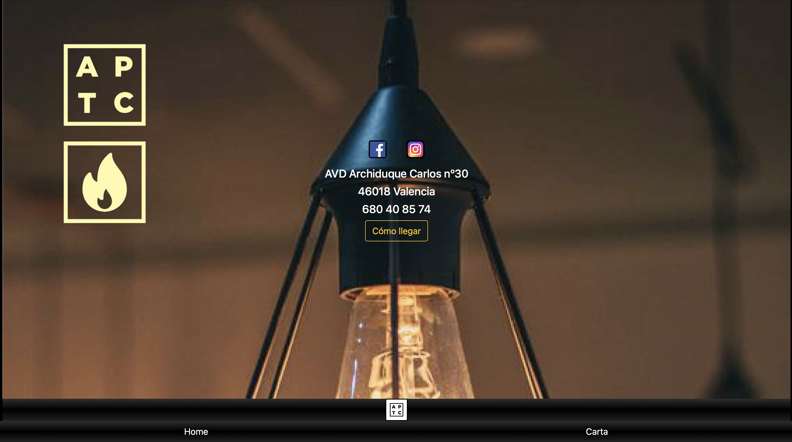

<h2 align="center">PROYECTO CARTA</h2>

Segundo proyecto realizado en geekshubs academy que consta de las siguientes partes.
 

Página principal

Sección de la carta 

Sección contactos  

 

<h5 align="center">LENGUAJES UTILIZADOS</h5>

Proyecto realizado en HTML y CSS, con ayuda del framework Bootstrap.

